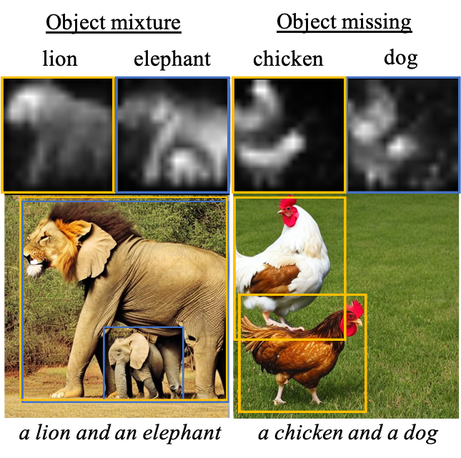
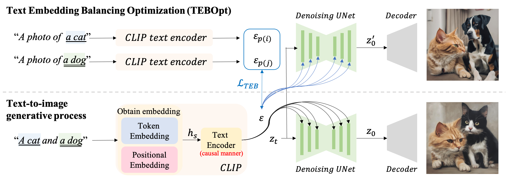

# A Cat Is A Cat (Not A Dog!): Unraveling Information Mix-ups in Text-to-Image Encoders through Causal Analysis and Embedding Optimization (NeurIPS, 2024)

[](https://arxiv.org/pdf/2410.00321) [](https://github.com/basiclab/Unraveling-Information-Mix-ups/blob/main/LICENSE)

[WIP] This repo provides the PyTorch source code of our paper. 

**Authors**: [Chieh-Yun Chen](https://chiehyunchen.github.io/), Chiang Tseng, Li-Wu Tsao, [Hong-Han Shuai](https://basiclab.lab.nycu.edu.tw/) at National Yang Ming Chiao Tung University in Taiwan.

## 🚀 1 Minute Summary
Text-to-image (T2I) diffusion models have the issue of information bias and loss. Previous works focus on addressing the issue through the denoising process. However, within T2I models, text encoder is the earlier module than the denoising process but there is no research about how text embeddings affect generated images. 



In this paper, we share a comprehensive analysis of text embedding: 
- How text embedding contributes to the generated images
- Why information gets lost and biases towards the first-mentioned object. 

Accordingly, we propose a simple but effective Text Embedding Balance Optimization method (TEBOpt), which is training-free, with an improvement of 125.42% on information balance in stable diffusion. 



Furthermore, we propose a new automatic evaluation metric that quantifies information loss more accurately than existing methods, achieving 81% concordance with human assessments. This metric effectively measures the presence and accuracy of objects, addressing the limitations of current distribution scores like CLIP’s text-image similarities. 


## 🌟 Citation

If you find our research helpful, we would appreciate that you give it a citation.
```
@article{Chen_2024_TEBOpt,
  title={A Cat Is A Cat (Not A Dog!): Unraveling Information Mix-ups in Text-to-Image Encoders through Causal Analysis and Embedding Optimization},
  author={Chen, Chieh-Yun and Tseng, Chiang and Tsao, Li-Wu and Shuai, Hong-Han},
  journal={Advances in Neural Information Processing Systems},
  year={2024}
}
```