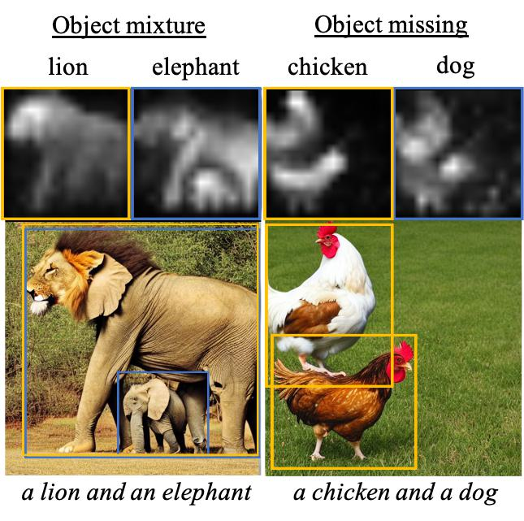

# A Cat Is A Cat (Not A Dog!): Unraveling Information Mix-ups

[](https://arxiv.org/pdf/2410.00321) [](https://github.com/basiclab/Unraveling-Information-Mix-ups/blob/main/LICENSE)

## 📝 Overview

This repository contains the PyTorch implementation of our NeurIPS 2024 paper:

> **A Cat Is A Cat (Not A Dog!): Unraveling Information Mix-ups in Text-to-Image Encoders through Causal Analysis and Embedding Optimization** <br>
> [Chieh-Yun Chen](https://chiehyunchen.github.io/), Chiang Tseng, Li-Wu Tsao, [Hong-Han Shuai](https://basiclab.lab.nycu.edu.tw/)<br>
> *National Yang Ming Chiao Tung University, Taiwan*

## 🔍 Problem & Solution

### The Challenge
Text-to-image (T2I) diffusion models suffer from information bias and loss. While previous works focused on the denoising process, we investigate how text embeddings in the earlier text encoder module affect generated images.



### Our Contributions

1. **Comprehensive Text Embedding Analysis**
   - Investigation of text embedding's impact on generated images
   - Understanding of information loss and first-mentioned object bias

2. **TEBOpt: Text Embedding Balance Optimization**
   - Training-free solution
   - 125.42% improvement on information balance in stable diffusion
   
   

3. **Novel Evaluation Metric**
   - Automatic quantification of information loss
   - 81% concordance with human assessments
   - Better measurement of object presence and accuracy compared to existing methods

## 🚀 Getting Started

### Prerequisites
```bash
conda env create -f environment.yml
conda activate TEB
```

### Basic Usage

1. **Run Inference**
   ```bash
   # With Text Embedding Balance Optimization
   CUDA_VISIBLE_DEVICES=0 python test.py --text_emb_optimize --indices_to_balance 2,5
   
   # Without Optimization
   CUDA_VISIBLE_DEVICES=0 python test.py
   ```

## 🔬 Experiments & Analysis

### 1. Token Embedding Analysis (Table 2)
```bash
# Unmasked
CUDA_VISIBLE_DEVICES=0 python test.py --data_dir ./data/masking.txt

# Mask all tokens (1:6)
CUDA_VISIBLE_DEVICES=0 python test.py --masking_token_emb --masking_token_index 1,6 --data_dir ./data/masking.txt

# Mask first object (1:4)
CUDA_VISIBLE_DEVICES=0 python test.py --masking_token_emb --masking_token_index 1,4 --data_dir ./data/masking.txt

# Mask second object (3:6)
CUDA_VISIBLE_DEVICES=0 python test.py --masking_token_emb --masking_token_index 3,6 --data_dir ./data/masking.txt
```

### 2. Special Tokens Analysis (Table 3)
```bash
CUDA_VISIBLE_DEVICES=0 python test.py --concat_pure_text_emb
```

### 3. Embedding Similarity Analysis (Tables 5 & 6)
```bash
# Default Analysis
CUDA_VISIBLE_DEVICES=0 python test.py --calcaluate_distance

# With TEBOpt
CUDA_VISIBLE_DEVICES=0 python test.py --calcaluate_distance --text_emb_optimize
```

### 4. Object Mixture/Missing Evaluation (Tables 1-4)
```bash
cd eval_metrics

# Evaluate Default Results
CUDA_VISIBLE_DEVICES=0 python eval.py --src_dir "../result/test_sample"

# Evaluate Optimized Results
CUDA_VISIBLE_DEVICES=0 python eval.py --src_dir "../result/test_sample_TEBOpt"
```

## 📊 Data Generation

```bash
cd data
python gen_prompt.py  # Customize: prompt count, objects per prompt, object candidates
```

## 📚 Citation

If you find our work useful, please consider citing:
```bibtex
@article{Chen_2024_TEBOpt,
  title={A Cat Is A Cat (Not A Dog!): Unraveling Information Mix-ups in Text-to-Image Encoders through Causal Analysis and Embedding Optimization},
  author={Chen, Chieh-Yun and Tseng, Chiang and Tsao, Li-Wu and Shuai, Hong-Han},
  journal={Advances in Neural Information Processing Systems},
  year={2024}
}
```