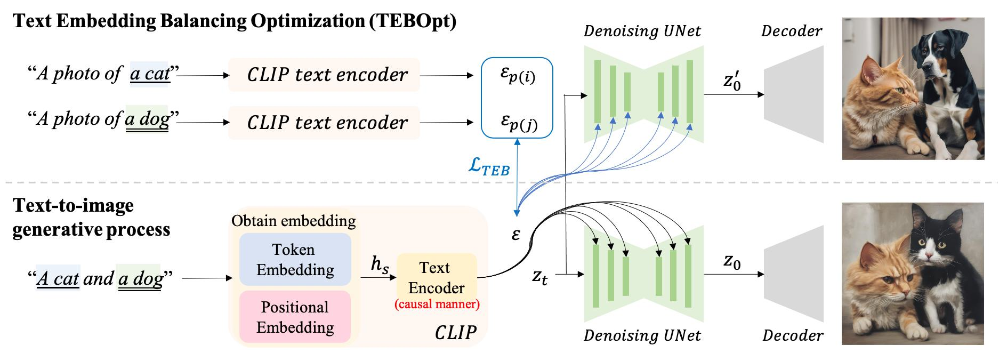

# A Cat Is A Cat (Not A Dog!): Unraveling Information Mix-ups

[](https://arxiv.org/pdf/2410.00321) [](https://github.com/basiclab/Unraveling-Information-Mix-ups/blob/main/LICENSE)

This repo provides the PyTorch source code of our paper.

> **A Cat Is A Cat (Not A Dog!): Unraveling Information Mix-ups in Text-to-Image Encoders through Causal Analysis and Embedding Optimization (NeurIPS, 2024)** <br>
> [Chieh-Yun Chen](https://chiehyunchen.github.io/), Chiang Tseng, Li-Wu Tsao, [Hong-Han Shuai](https://basiclab.lab.nycu.edu.tw/)<br>
> *National Yang Ming Chiao Tung University, Taiwan*


## 🚀 1 Minute Summary
Text-to-image (T2I) diffusion models have the issue of information bias and loss. Previous works focus on addressing the issue through the denoising process. However, within T2I models, text encoder is the earlier module than the denoising process but there is no research about how text embeddings affect generated images. 


In this paper, we share a comprehensive analysis of text embedding: 
- How text embedding contributes to the generated images
- Why information gets lost and biases towards the first-mentioned object. 

Accordingly, we propose a simple but effective Text Embedding Balance Optimization method (TEBOpt), which is training-free, with an improvement of 125.42% on information balance in stable diffusion. 



Furthermore, we propose a new automatic evaluation metric that quantifies information loss more accurately than existing methods, achieving 81% concordance with human assessments. This metric effectively measures the presence and accuracy of objects, addressing the limitations of current distribution scores like CLIP’s text-image similarities. 

## Quick Start!

### Environment Setup
```
$ conda env create -f environment.yml
$ conda activate TEB
```
### Inference

- Test samples with our proposed Text Embedding Balance Optimization
    ```
    $ CUDA_VISIBLE_DEVICES=0 python test.py  --text_emb_optimize --indices_to_balance 2,5
    ```
- Test samples without our proposed Text Embedding Balance Optimization
    ```
    $ CUDA_VISIBLE_DEVICES=0 python test.py
    ```

### Analysis
1. Masking token embedding (Table 2)
    - Unmasked
        ```
        $ CUDA_VISIBLE_DEVICES=0 python test.py --data_dir ./data/masking.txt
        ```

    - Masking all given tokens (tokens index 1:6)
        ```
        $ CUDA_VISIBLE_DEVICES=0 python test.py --masking_token_emb --masking_token_index 1,6 --data_dir ./data/masking.txt
        ```

    - Masking first object (tokens index 1:4)
        ```
        $ CUDA_VISIBLE_DEVICES=0 python test.py --masking_token_emb --masking_token_index 1,4 --data_dir ./data/masking.txt
        ```

    - Masking second object (tokens index 3:6)
        ```
        $ CUDA_VISIBLE_DEVICES=0 python test.py --masking_token_emb --masking_token_index 3,6 --data_dir ./data/masking.txt
        ```
2. Hypothesis for combined special tokens' pure embeddings (Table 3)
    ```
    $ CUDA_VISIBLE_DEVICES=0 python test.py --concat_pure_text_emb
    ```

3. Calculate text embedding similarity and cross-attention map distance (Table 5 and 6)
    - Default
        ```
        $ CUDA_VISIBLE_DEVICES=0 python test.py --calcaluate_distance
        ```

    - With Text Embedding Balance Optimization
        ```
        $ CUDA_VISIBLE_DEVICES=0 python test.py --calcaluate_distance --text_emb_optimize
        ```

### Proposed evaluation metric for object mixture/missing (Table 1-4)
```
$ cd eval_metrics

# Evaluating the default result
$ CUDA_VISIBLE_DEVICES=0 python eval.py --src_dir "../result/test_sample"

# Evaluating the optimized result
$ CUDA_VISIBLE_DEVICES=0 python eval.py --src_dir "../result/test_sample_TEBOpt"
```

### Create data

```
$ cd data

# Please feel free to modify i) the target number of prompts, ii) object number within one prompt and iii) object candidates.
$ python gen_prompt.py
```

<!-- ## 🙏 Acknowledgements

We are grateful for the code shared by [FPE](https://github.com/alibaba/EasyNLP/tree/master/diffusion/FreePromptEditing) and [SynGen](https://github.com/RoyiRa/Linguistic-Binding-in-Diffusion-Models). Utilizing their resources implies agreement to their respective licenses. Our project benefits from these contributions, and we acknowledge their impact on our work. -->

## 🌟 Citation

If you find our research helpful, we would appreciate that you give it a citation.
```
@article{Chen_2024_TEBOpt,
  title={A Cat Is A Cat (Not A Dog!): Unraveling Information Mix-ups in Text-to-Image Encoders through Causal Analysis and Embedding Optimization},
  author={Chen, Chieh-Yun and Tseng, Chiang and Tsao, Li-Wu and Shuai, Hong-Han},
  journal={Advances in Neural Information Processing Systems},
  year={2024}
}
```